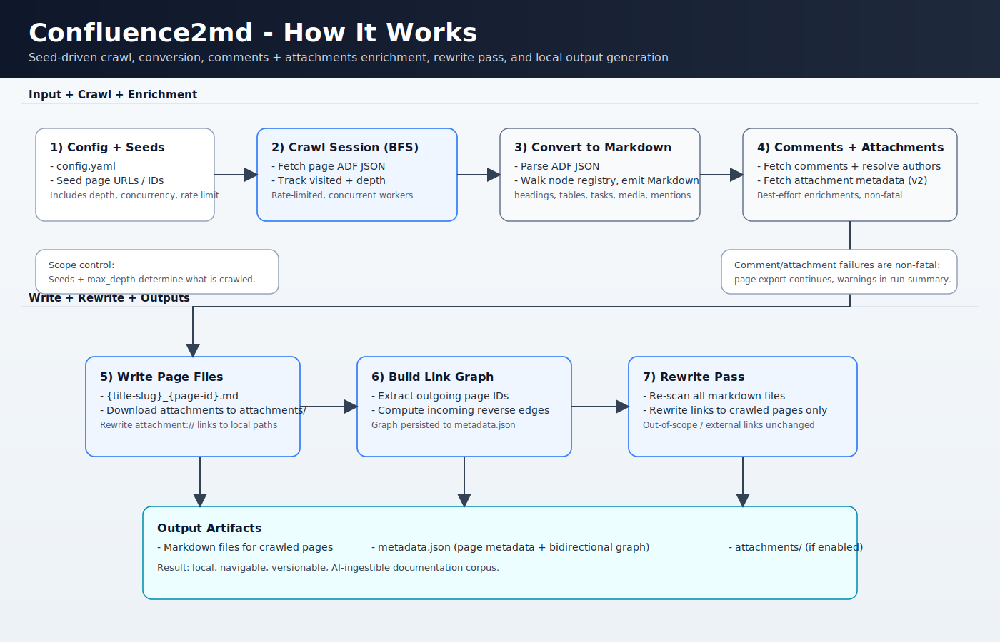

# `confluence2md` - Confluence to Markdown crawler and converter

[](https://github.com/gkoos/confluence2md/actions/workflows/ci.yml)
[](https://github.com/gkoos/confluence2md/releases)
[](https://github.com/gkoos/confluence2md/blob/main/LICENSE)
[](https://github.com/gkoos/confluence2md/blob/main/go.mod)
[](https://goreportcard.com/report/github.com/gkoos/confluence2md)

Turn your Confluence space into Markdown files on your hard drive and use that local copy to:

- build a second brain
- feed AI/RAG pipelines
- version docs in Git
- browse offline in your preferred Markdown editor
- power local full-text search across docs
- support onboarding with a portable docs snapshot
- preserve runbooks for incident response and disaster recovery
- export knowledge for compliance and audit evidence trails
- reduce vendor lock-in by keeping docs in an open format.

What you get:
- One local `.md` file per crawled page, with stable filenames that include page IDs.
- Deterministic YAML front matter on each page with source/provenance fields and `is_seed`.
- Links between crawled pages rewritten to relative local links.
- External or out-of-scope links preserved as original URLs.
- Page comments appended under a `## Comments` section.
- A human-friendly `index.md` start page with crawl summary and seed links.
- A `metadata.json` index with page metadata plus incoming/outgoing link graph data.

## What It Does

- Starts from configured seed pages and traverses linked Confluence pages up to a configurable depth.
- Converts each page from Confluence storage format to Markdown and writes it to the local filesystem.
- Runs a second pass to rewrite links between crawled pages as relative local links.
- Leaves all other URLs unchanged — including links to uncrawled Confluence pages and external sites.
- Downloads page attachments and rewrites attachment references to point to the downloaded files.
- Appends page comments under a `## Comments` section in each page file.
- Writes a single `metadata.json` with crawl metadata and a bidirectional link graph.
- Persists configured seed page IDs at metadata root (`seed_page_ids`) for stable seed semantics.
- Supports two run modes:
  - **full**: crawl all pages reachable from seeds up to max depth.
  - **updates**: run the same seed-based traversal as full mode, but selectively re-process dirty pages while reusing clean-page artifacts.

## Download

Pre-built binaries are available on the [Releases](https://github.com/gkoos/confluence2md/releases) page.

1. Download the archive for your platform.
2. Extract the binary (`confluence2md` or `confluence2md.exe`).
3. Run it from the directory containing your `config.yaml`.

## How To Use

### Requirements

- A valid Atlassian API token with read access to the target spaces

You can generate an Atlassian API token from your Atlassian account security page:

- https://id.atlassian.com/manage-profile/security/api-tokens

If you run into authentication issues, see [Operations and Troubleshooting](docs/operations.md).

### Configuration

Copy `config.example.yaml` to `config.yaml` and fill in the required values.

```yaml
confluence:
  # Your Atlassian account email
  username: you@example.com
  # Atlassian API token (https://id.atlassian.com/manage-profile/security/api-tokens)
  # Can also be set via env var: CONFLUENCE_TOKEN
  token: ""

crawl:
  # One or more seed page URLs or page IDs to start from
  seeds:
    - https://your-org.atlassian.net/wiki/spaces/SPACE/pages/123456/Page+Title
  # Maximum link-follow depth from each seed (0 = seed pages only)
  max_depth: 3
  # Maximum concurrent API requests
  concurrency: 5
  # Target HTTP requests per minute across all Confluence API calls
  # (transport-level limiter; Confluence Cloud is ~300/min per token)
  rate_limit_rpm: 250

output:
  # Directory to write Markdown files, attachments, and metadata
  dir: ./output

attachments:
  # Download attachments referenced by crawled pages
  download: true
  # Skip attachments larger than this size (0 = no limit)
  max_size_mb: 100

retry:
  # Maximum number of retries for transient API errors (429, 5xx)
  max_attempts: 5
  # Initial backoff in milliseconds (doubles with each retry + jitter)
  initial_backoff_ms: 1000
```

### Quickstart

Now run a full crawl:

```sh
confluence2md --mode full
```

Note: full mode clears the configured output directory before crawling.

Once it completes, start at `output/index.md` for crawl summary and seed entrypoints.

### CLI Usage

```sh
# Full crawl (crawls all pages reachable from seeds up to max depth)
confluence2md --mode full

# Incremental update (same seed traversal, selective page re-processing)
confluence2md --mode updates

# Validate config and Confluence API credentials without crawling
confluence2md validate
```

The tool looks for `config.yaml` in the current directory by default. Use `--config` to specify a different path:

```sh
confluence2md --config /path/to/config.yaml --mode full
confluence2md --config /path/to/config.yaml validate
```

After each run a summary is printed to stdout:

```
=== Crawl Complete ===
Mode: full
Total pages crawled: 13
Pages written successfully: 13
Pages with errors: 0
Internal crawl links discovered (edge count): 14
Unique internal target pages linked: 12
External links skipped (host filter): 5
Pages with rewritten links: 4/13
Markdown links rewritten to local paths: 14/25
Pages with comments appended: 1
Total comments fetched: 2
Pages with comment fetch warnings: 0
Output directory: ./output
```

For updates mode, the summary additionally reports:

- Reachable pages
- Pages re-rendered
- Pages reused without full re-processing
- Re-render saves (count and percent)
- Managed files added/updated/deleted
- Attachments downloaded/reused
- Output commit status
- Checkpoint advanced status (successful-checkpoint advancement)

Note: current output commit behavior is direct-write (non-transactional).

## How It Works

### Filename Conventions

Every page is saved as:

```
{title-slug}_{page-id}.md
```

The page ID is always included so renames (title changes) are detectable and the file can be consistently identified across runs. Attachments are saved under an `attachments/` directory alongside the pages.

**How link rewriting works — two passes:**

1. **Crawl pass:** all pages are fetched and written to disk with their original Confluence URLs still intact. As each page is saved, its page ID and local filename are recorded in `metadata.json`. No links are rewritten yet.
2. **Rewrite pass:** once the full crawled set is known, every page is scanned. For each link, if the target page ID exists in `metadata.json` (i.e. it was crawled), the URL is replaced with a relative local path. If not — whether it is a Confluence page that was out of scope, beyond max depth, or a completely different site — the original URL is left unchanged.

Because the rewrite pass only runs after crawling is complete, every decision is a simple lookup with no iteration or guesswork.

### Output Layout

```
output/
├── index.md                      # start-here page: crawl summary + seed links
├── metadata.json                  # all-pages index: metadata + link graph
├── {title-slug}_{page-id}.md      # one file per page (front matter + page body + comments)
└── attachments/
  └── {page-id}_{original-filename}
```

### Markdown Front Matter

Each exported page starts with deterministic YAML front matter:

- Required fields:
  - `page_id`
  - `title`
  - `source_url`
  - `canonical_url`
  - `space_key`
  - `is_seed`
  - `crawled_at`
- Optional fields:
  - `comment_count` (present only when greater than 0)
  - `comments_fetch_error` (present only when non-empty)
  - `attachments` (present only when non-empty)

Seed semantics:

- `is_seed` is derived from membership in metadata root `seed_page_ids`.
- Traversal `depth` is still tracked in `metadata.json`, but not surfaced in front matter.

## Building, Testing, and Internals

### Building

Install [Task](https://taskfile.dev/installation/), then:

```sh
task build        # builds bin/confluence2md.exe
task test         # runs all tests
task lint         # runs golangci-lint
```

### Release Artifacts

GitHub Releases publish platform binaries as compressed archives:

- Linux/macOS: `.tar.gz`
- Windows: `.zip`

Supported release targets:

- `linux/amd64`
- `linux/arm64`
- `darwin/amd64`
- `darwin/arm64`
- `windows/amd64`
- `windows/arm64`

Executable name inside archives:

- Linux/macOS: `confluence2md`
- Windows: `confluence2md.exe`

### Internals Documentation

The diagram below shows how the full crawl mode works at a high level. For more details on specific parts of the implementation, see the linked docs:



- [Operations and troubleshooting](docs/operations.md)
- [Markdown conversion internals](docs/markdown-conversion.md)
- [Attachments retrieval internals](docs/attachments-fetching.md)
- [Comments fetching internals](docs/comments-fetching.md)

### Project Structure

```
confluence2md/
├── .gitignore
├── LICENSE
├── README.md
├── CONTRIBUTING.md
├── Taskfile.yml
├── config.example.yaml
├── config.yaml                      # local runtime config (gitignored)
├── go.mod / go.sum
├── bin/                             # compiled binaries (gitignored)
│
├── cmd/
│   └── crawler/
│       ├── main.go                  # CLI command wiring + thin run coordinator
│       ├── run_pipeline.go          # run phases, per-page handlers, finalization, summary output
│       ├── setup.go                 # config summary, client/auth checks, seed resolution
│       ├── link_utils.go            # markdown/link/attachment placeholder rewrites
│       ├── finalize.go              # graph rebuild + rewrite + artifact reconciliation
│       ├── helpers.go               # small shared helpers for run pipeline
│       └── main_test.go             # command/finalization/reconciliation tests
│
└── internal/
    ├── config/
    │   └── config.go                # struct, Load(), Validate()
    │
    ├── confluence/
    │   ├── client.go                # Confluence API client methods
    │   ├── comments_client.go       # comment fetch + author enrichment flow
    │   ├── http_helpers.go          # authenticated request/response helpers
    │   ├── parsing.go               # shared API parsing helpers
    │   └── models.go                # local types mapped from API responses
    │
    ├── crawl/
    │   └── full.go                  # crawl session orchestration and traversal
    │
    ├── convert/
    │   ├── markdown.go              # orchestrates page → markdown pipeline
    │   ├── parser.go                # XML parser for Confluence storage format
    │   ├── parser_macros.go         # macro renderers/handlers
    │   └── comments.go              # formats comments into ## Comments section
    │
    ├── links/
    │   ├── rewriter.go              # pass-2 link rewrite using metadata map
    │   └── extractor.go             # extracts page IDs from storage format links
    │
    ├── store/
    │   ├── fs.go                    # page writes + metadata.json persistence
    │   └── attachments.go           # attachment file download/persistence helpers
```

## Backlog and Roadmap

- Optional Git integration to commit changes after each crawl with a configurable message template.
- Support for crawling Confluence Server/Data Center instances (currently only Cloud API is supported).

## License

MIT
